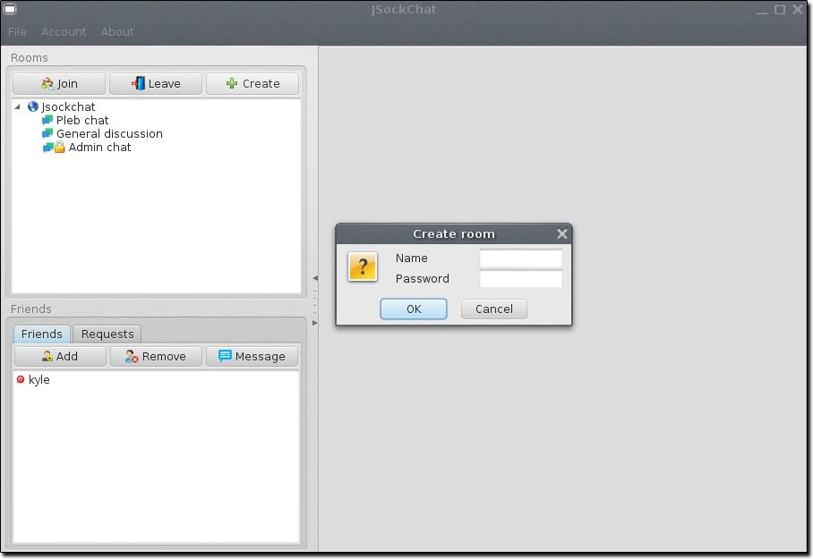

# JSock Chat

JSock Chat is a desktop chat application that uses message passing  
via TCP socket communication and client message broadcasting via UDP  
For a complete user guide and technical notes see the [documentation](Documentation/UserGuide.pdf)

## Features
#### User Registration
Users are able to create permanant accounts with the application

#### User Login
Users can sign into their created accounts using a username and password

#### Free Connect
Users can connect to any JSock Chat hosting server given a IP/Port

#### Add/Remove Friends
JSock Chat allows users to have friends which they can add or remove  
Users can see when their friends are online and directly message them

#### Chat Rooms
Users can create their own chat rooms or join existing ones  
Rooms can be made private by password locking them

### Installation
- [Download](https://github.com/kyleruss/jsock-chat/releases/latest) the latest release
- Unzip the contents into an appropriate directory
- Run the server in `jsockchat-server/JSockChatServer.exe`
- Run the client in `jsockchat-client/JSockChatClient.exe`
- Enter the server address and port to connect (Default IP: 127.0.0.1, Port: 8890)

### License
JSock Chat is available under the MIT License  
See [LICENSE](LICENSE) for more details
